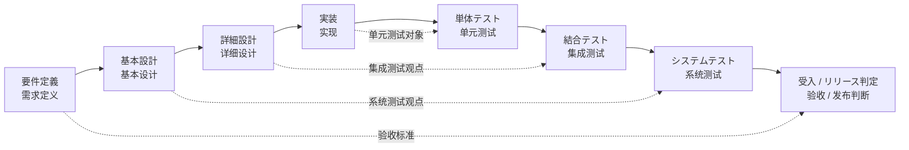

# 总览

## 1. V字开发

V 字开发的核心，不在于“先写文档，后写代码”，而在于左侧的定义与设计，最终都要在右侧被验证。

最基本的对应关系如下：

- `要件定义` 对应验收与发布判断
- `基本設計` 对应系统测试
- `詳細設計` 对应集成测试
- `実装` 对应单元测试

## 2. AI Native

AI Native 不是在每个阶段旁边增加一个聊天窗口，也不是让 AI 替代工程师。

这里所说的 AI Native，指的是：

- AI 参与澄清、整理、检查、追踪和分析
- 人负责确认、取舍、批准和最终质量责任
- 需求、设计、实现、测试之间的关系保持可追踪

因此，AI Native 不是脱离 V 字开发另起一套体系，而是沿着 V 字开发的链路，把 AI 放进各个关键环节。

## 3. 要件定义

上游需求如果本身就是模糊的，后面的设计、实现和测试只会继续传递模糊性。

`要件定义` 阶段首先要解决的问题包括：

- 一句话需求如何问清楚
- 现状行为与目标行为如何区分
- 范围内外如何划清
- 验收标准如何尽早形成
- 哪些内容是事实，哪些内容只是推测

围绕这一层，当前已经形成的内容包括：

1. 一句话输入
2. Grill 追问
3. 事实、假设、待确认整理
4. `context-pack.md`
5. `requirement-draft.md`
6. `next-phase-input.md`
7. 最小追踪关系

## 4. 相关文档

- [要件定义实施方案](../30-requirement-definition/requirement-definition-implementation.md)
- [要件定义 Grill Skill](../30-requirement-definition/requirement-grill-skill.md)
- [AI Native 原则](../10-v-model-framework/ai-native-principles.md)
