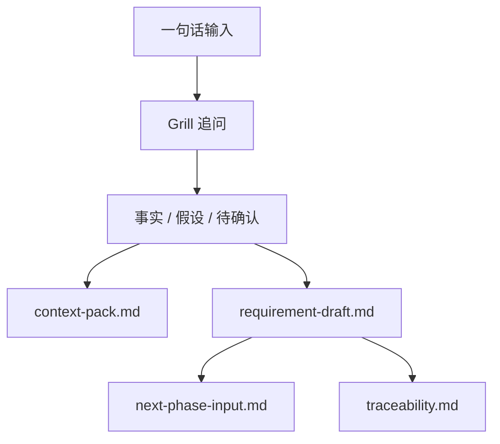
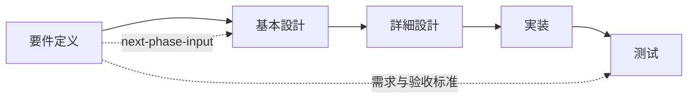

# AI Native V字模型图示

## 要件定义输出链路

```mermaid
flowchart TB
  IN["一句话输入"]
  GRILL["Grill 追问"]
  FACTS["事实 / 假设 / 待确认"]
  CTX["context-pack.md"]
  DRAFT["requirement-draft.md"]
  NEXT["next-phase-input.md"]
  TRACE["traceability.md"]

  IN --> GRILL
  GRILL --> FACTS
  FACTS --> CTX
  FACTS --> DRAFT
  DRAFT --> NEXT
  DRAFT --> TRACE
```

## 要件定义与后续阶段关系

```mermaid
flowchart LR
  REQ["要件定义"]
  BD["基本設計"]
  DD["詳細設計"]
  IMP["実装"]
  TEST["测试"]

  REQ --> BD
  BD --> DD
  DD --> IMP
  IMP --> TEST

  REQ -. "需求与验收标准" .-> TEST
  REQ -. "next-phase-input" .-> BD
```
