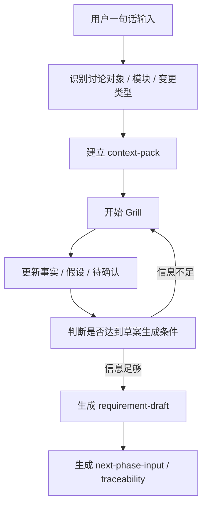

# 要件定义实施方案

## 1. 问题

传统 V 字开发的问题，不在于没有文档，而在于上游输入经常带着模糊性进入后续阶段：

- 需求描述不完整，靠会议和经验补。
- 现状行为、目标行为、范围边界混在一起。
- 异常场景和非功能要求经常后置。
- 需求、验收标准、设计和测试之间缺乏稳定追踪。
- 对话里讲清楚的内容，难以沉淀成可复用文档。

因此，`要件定义` 先要解决的不是“写出正式文档”，而是把模糊需求变成可继续讨论、可评审、可进入后续设计的输入。

这条工作链路如下：

```text
一句话输入
-> 结构化追问
-> 区分事实 / 假设 / 待确认
-> 形成中间文档
-> 形成要件定义草案
-> 输出给基本设计的下一阶段输入
```

## 2. 范围

范围只覆盖 `要件定义`。

包含：

- 用户一句话启动需求讨论。
- 识别当前讨论对象、模块和变更类型。
- 逐步追问现状、目标、范围、异常、非功能和验收标准。
- 生成中间文档和草案文档。
- 输出给 `基本設計` 的输入材料。

不包含：

- `基本設計` 的详细生成规则。
- `詳細設計`、实现、测试阶段的实施细节。
- 平台接入、自动化编排、RAG 工程化落地。
- 多 Agent、subagent、hooks 等扩展机制。

## 3. 原则

### 3.1 人工批准是边界

AI 可以起草、追问、总结和整理，但不能把内容直接变成正式基线文档。

建议状态：

| 状态 | 含义 |
| --- | --- |
| AI Draft | AI 生成的草案 |
| User Confirmed | 用户已明确确认关键内容 |
| Review Ready | 已具备进入正式评审的条件 |

### 3.2 一次只解决一个关键问题

要求：

- 一次只问一个关键问题。
- 每个问题都要推动结构前进。
- 每个问题都给推荐答案。
- 已确认内容不重复追问。

### 3.3 事实、假设、待确认必须分开

必须区分：

- 文档事实
- 用户确认
- AI 假设
- 待确认问题

### 3.4 输出必须服务下一阶段

输出文档必须直接支撑：

- 要件评审
- 基本设计输入
- 测试观点传递
- 追踪关系建立

## 4. 要件定义

`要件定义` 先把模糊需求转成以下几类结构化结果：

- 已确认事实
- AI 假设
- 未决问题
- 要件定义草案
- 验收标准候选
- 下一阶段输入

### 4.1 最小输入

用户最小输入只需要一句话，例如：

```text
这个功能现在在某个场景下不满足需求，想改一下。
```

### 4.2 工作链路



## 5. 实施方法

### 5.1 追问顺序

1. 识别变更类型
2. 确认现状行为
3. 定义目标行为
4. 划清范围边界
5. 识别异常和边界条件
6. 补齐非功能要求
7. 形成验收标准
8. 形成下一阶段输入

### 5.2 最小追问树

#### 第一层：这次到底在改什么

- 是新功能、既存改修、规则变更、障害修正，还是运维改善？
- 这次变更的业务目的是什么？
- 如果不改，会造成什么问题？

#### 第二层：现状到底是什么

- 当前系统怎么处理这个场景？
- 当前行为有没有既存依据？
- 当前行为和期望差在哪里？

#### 第三层：目标行为到底是什么

- 正常场景下希望系统怎么处理？
- 哪些输入条件会触发新行为？
- 哪些情况不应触发？
- 是否影响输出、状态、接口、通知、日志？

#### 第四层：范围到哪里为止

- 本次改修包含哪些场景？
- 明确不包含哪些场景？
- 哪些模块只受影响但不改？

#### 第五层：异常和边界条件

- 输入缺失、重复、延迟怎么办？
- 上下游失败怎么办？
- 是否涉及并发、顺序、幂等、回滚？

#### 第六层：非功能要求

- 是否有性能要求？
- 是否影响批处理、在线处理或外部接口？
- 是否需要日志、监控、告警？
- 是否涉及权限、审计、敏感数据？

#### 第七层：验收标准

- 什么结果表示改修成功？
- 至少需要哪些正常场景测试？
- 至少需要哪些异常场景测试？
- 哪些既存行为必须保持不变？

#### 第八层：给基本设计什么输入

- 哪些系统行为变化要交给基本设计确认？
- 哪些接口、数据项、状态变化需要设计展开？
- 哪些测试观点必须传递下去？

## 6. 输出

### 6.1 `context-pack.md`

- 讨论对象
- 业务域
- 模块 / 子模块
- 变更类型
- 已确认事实
- 用户确认事项
- AI 假设
- 未决问题
- 引用资料

### 6.2 `requirement-draft.md`

- 背景
- 目的
- 范围
- 现状行为
- 目标行为
- 业务规则
- 异常场景
- 非功能要求
- 验收标准
- 未决问题

### 6.3 `next-phase-input.md`

- 系统行为变化点
- 需要设计确认的接口
- 需要设计确认的数据项
- 需要设计确认的状态变化
- 需要重点设计的异常和边界条件
- 系统测试观点候选

### 6.4 `traceability.md`

| 需求 ID | 验收标准 ID | 基本设计观点 | 测试观点 | 状态 |
| --- | --- | --- | --- | --- |
| REQ-001 | AC-001 | TBD | TBD | Draft |
