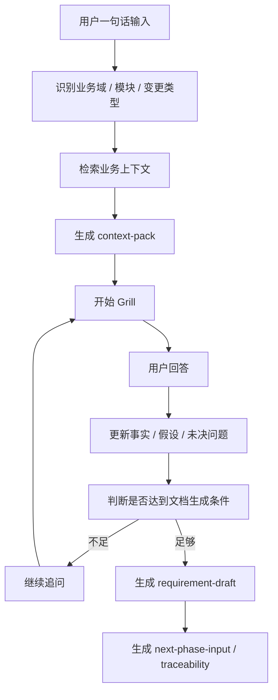

# 要件定义 Grill Skill

## 定位

要件定义 Grill Skill 是当前实施方案中最核心的方法文档。

它的目标不是直接替人写正式要件定义书，而是通过持续追问，把一个模糊的业务想法、改修诉求或新功能想法，整理成：

- 可评审的要件定义草案。
- 已确认事实。
- AI 假设。
- 未决问题。
- 验收标准候选。
- 下一阶段 `基本設計` 的输入。

## 核心原则

### 1. 一句话即可启动

允许用户从一句话开始，不要求先填复杂表单。

例如：

```text
这次想改某个功能，因为现在有一个问题。
```

### 2. 一次只问一个关键问题

每次只问一个问题。

这个问题必须满足：

- 当前最关键。
- 回答后能减少不确定性。
- 能推动文档结构前进。
- 不重复已经确认过的内容。

### 3. 每个问题都给推荐答案

每个问题都要给推荐答案，降低回答成本。

格式：

```text
问题：
这次变更的主要类型是什么？

我的推荐答案：
如果还不确定，先标记为“既存功能改修”，因为当前描述更像在改变已有行为，而不是新增独立功能。
```

### 4. 不确定就标记，不编造成事实

必须明确区分：

- 文档事实。
- 用户确认。
- AI 假设。
- 待确认。

AI 假设不能直接进入正式要件，只能进入草案或未决问题。

## 输入

### 用户输入

最小输入是一句话，例如：

```text
某个模块要改某个功能，因为现在某个场景下不满足需求。
```

### 系统输入

如果存在知识库，Skill 可以读取：

- 术语表。
- 模块边界。
- 当前状态说明。
- 既存要件定义。
- 既存基本设计。
- 既存测试规格书。
- 历史改修票。
- 缺陷票。

## 输出

### 1. `context-pack.md`

记录本次讨论的上下文基础。

包含：

- 当前讨论对象。
- 业务域。
- 模块。
- 子模块。
- 变更类型。
- 已确认事实。
- 引用资料。
- 用户已确认事项。
- AI 假设。
- 未决问题。

### 2. `requirement-draft.md`

形成要件定义草案。

包含：

- 背景。
- 目的。
- 范围。
- 现状行为。
- 目标行为。
- 业务规则。
- 异常场景。
- 非功能要求。
- 验收标准。
- 未决问题。

### 3. `next-phase-input.md`

给 `基本設計` 阶段的输入。

包含：

- 系统行为变化点。
- 需要设计确认的接口。
- 需要设计确认的数据项。
- 需要设计确认的状态变化。
- 需要考虑的异常和边界条件。
- 系统测试观点候选。

### 4. `traceability.md`

记录最小追踪关系。

包含：

| 需求 ID | 验收标准 ID | 基本设计观点 | 测试观点 | 状态 |
| --- | --- | --- | --- | --- |
| REQ-001 | AC-001 | TBD | TBD | Draft |

## 工作流程



## 执行顺序

追问顺序固定如下：

1. 识别当前变更
2. 确认现状
3. 定义目标行为
4. 确认范围边界
5. 补齐异常和边界条件
6. 补齐非功能要求
7. 形成验收标准
8. 形成下一阶段输入

## 追问树

### 1. 识别当前变更

要回答：

- 这次是新功能、既存功能改修、规则变更、障害修正，还是运维改善？
- 这次变更的业务目的是什么？
- 触发这次变更的背景是什么？
- 如果不做这次变更，会有什么问题？

### 2. 确认现状

要回答：

- 当前系统在这个场景下是怎么处理的？
- 当前行为是否有既存文档依据？
- 当前行为哪里不符合预期？
- 有没有历史改修或缺陷与此相关？

### 3. 定义目标行为

要回答：

- 变更后希望系统在正常场景下怎么处理？
- 哪些输入条件会触发新行为？
- 哪些情况不应该触发新行为？
- 输出、状态、账务、通知、日志、接口等是否会变化？

### 4. 确认范围边界

要回答：

- 本次范围内包含哪些场景？
- 明确不包含哪些场景？
- 哪些模块只受影响但不改修？
- 哪些内容需要留到后续阶段？

### 5. 异常和边界条件

要回答：

- 输入缺失、重复、延迟、状态不一致时怎么处理？
- 上游或下游失败时怎么处理？
- 历史数据、跨期间数据、重跑数据是否受影响？
- 是否存在并发、顺序、幂等、回滚问题？

### 6. 非功能要求

要回答：

- 性能或处理时间有要求吗？
- 是否影响既存批处理、在线处理或外部接口？
- 是否需要日志、监控、告警？
- 是否涉及权限、审计、个人信息或敏感数据？

### 7. 验收标准

要回答：

- 什么结果表示这次改修成功？
- 至少需要哪些正常场景测试？
- 至少需要哪些异常场景测试？
- 哪些既存行为必须保持不变？

### 8. 下一阶段输入

要回答：

- 基本设计阶段需要重点确认哪些系统行为？
- 哪些接口或数据项需要设计？
- 哪些状态变化需要画图或表格？
- 哪些测试观点必须传递给后续阶段？

## 文档生成条件

只有满足以下条件，才生成 `requirement-draft.md`：

- 已识别变更类型。
- 已确认业务目的。
- 已记录当前行为或标记为待确认。
- 已定义目标行为。
- 已明确范围内和范围外。
- 已列出关键异常场景。
- 已生成至少一组验收标准候选。
- 未确认内容已进入未决问题。

## 失败处理

如果上下文不足：

- 停止生成正式草案。
- 输出缺失信息清单。
- 把可疑内容标记为 AI 假设。
- 追问当前最关键问题。

如果用户暂时无法回答：

- 提供候选答案。
- 标记推荐答案的依据。
- 允许用户选择“暂时不确定”。
- 把问题写入 `open-questions.md`。

## 输出状态

当前建议使用以下状态：

| 状态 | 含义 |
| --- | --- |
| Draft | 草案，未经过完整确认 |
| User Confirmed | 用户已确认主要内容 |
| Review Ready | 可以进入正式评审 |
| Approved | 已成为正式基线 |
