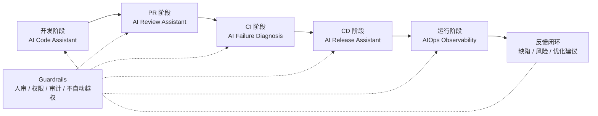
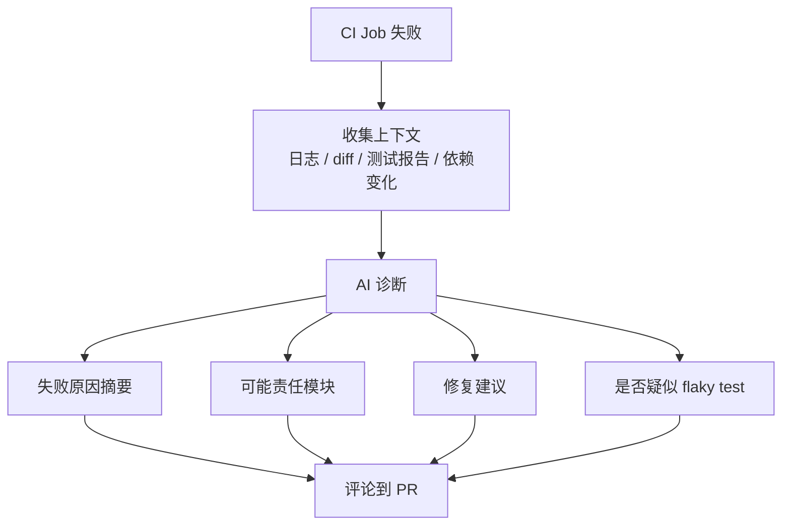
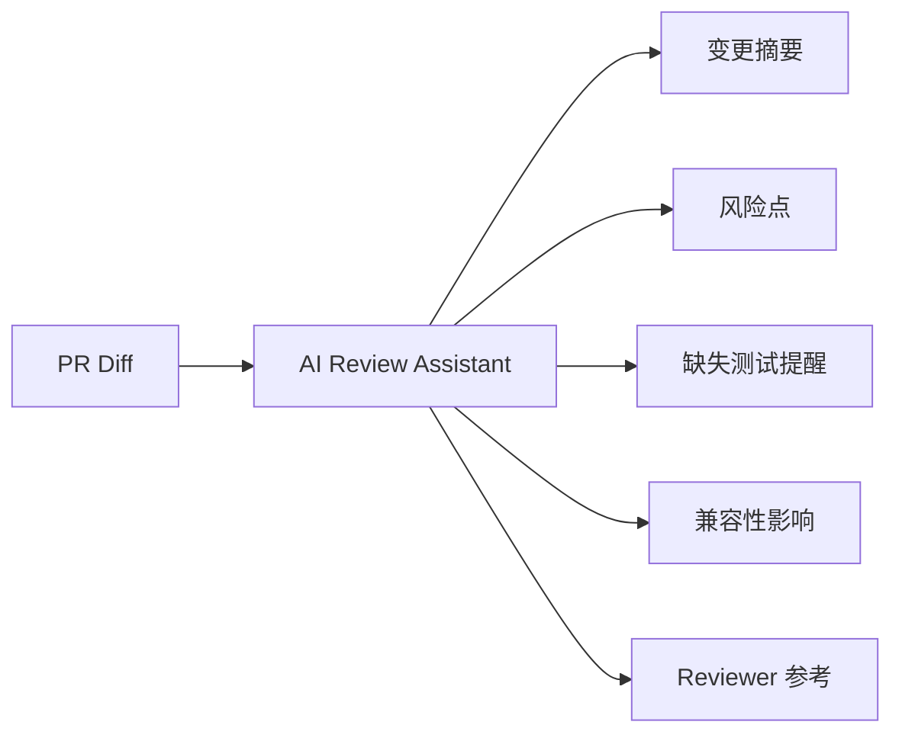
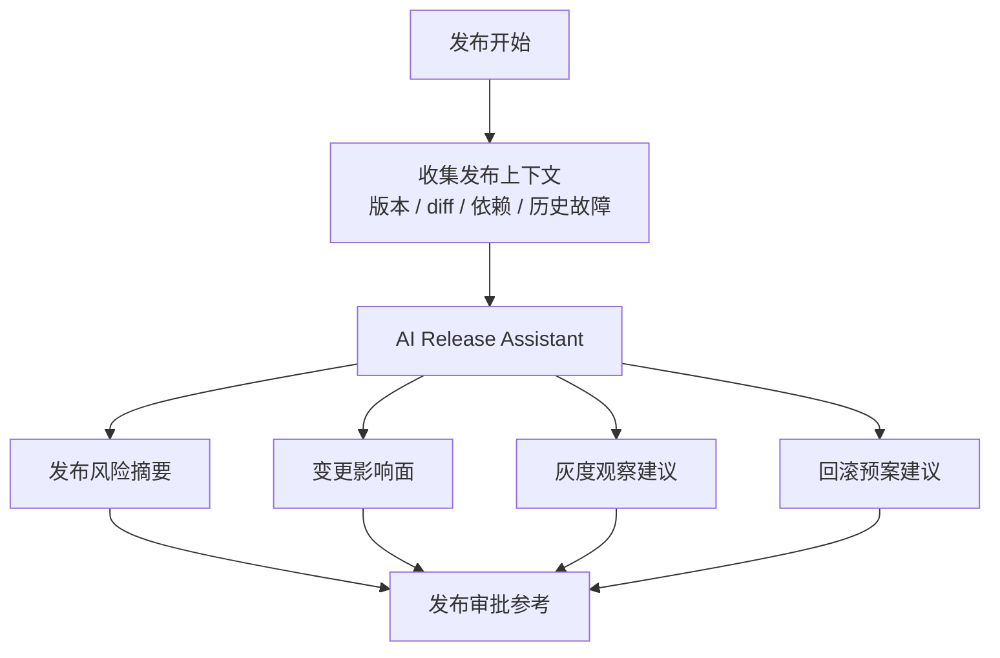
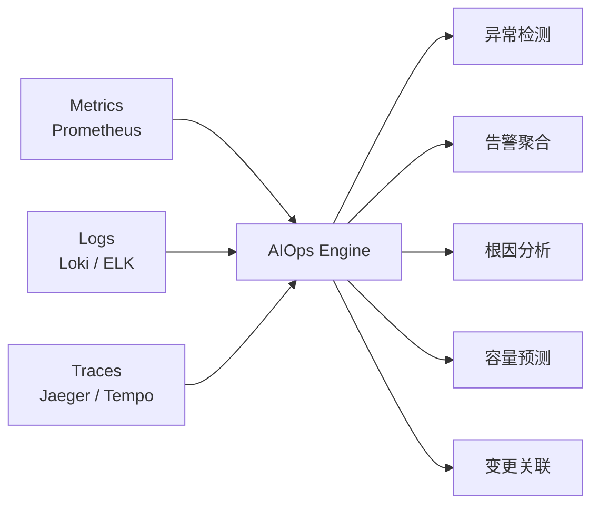
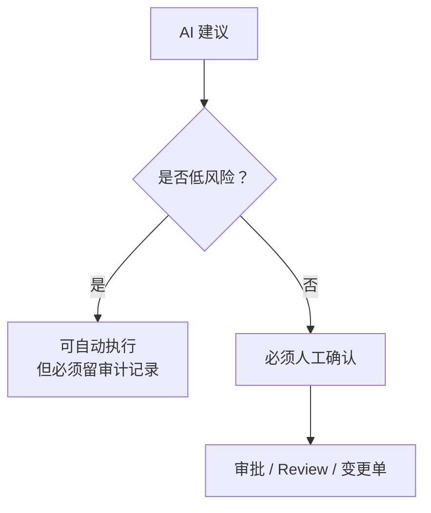

# AI / AIOps 与 CI/CD 结合设计

## 1. 总览图



AI 在 CI/CD 里的定位：

- 可以辅助分析、总结、推荐和自动生成修复建议。
- 可以自动处理低风险、可回滚、可审计的动作。
- 不应该直接绕过门禁、审批或安全策略。

## 2. 各阶段可以怎么用 AI

| 阶段 | AI 能做什么 | 价值 |
| --- | --- | --- |
| 开发阶段 | 代码补全、单测生成、解释代码、生成提交说明 | 提升开发效率 |
| PR 阶段 | 总结变更、辅助 Review、识别风险点、提示缺少测试 | 提升 Review 质量 |
| CI 阶段 | 分析失败日志、归因失败原因、推荐修复方案、识别 flaky test | 缩短排障时间 |
| 安全扫描阶段 | 汇总 SCA/SAST 结果、解释漏洞影响、建议修复版本 | 降低安全理解成本 |
| CD 阶段 | 生成发布摘要、判断灰度指标趋势、辅助回滚建议 | 降低发布风险 |
| 运行阶段 | 异常检测、告警聚合、根因分析、容量预测 | 提升稳定性治理 |
| 反馈闭环 | 把线上问题反推到测试、监控、代码规则 | 持续改进工程质量 |

## 3. CI 中的 AI 能力



适合场景：

- build 失败日志太长。
- 单测失败原因不明显。
- 依赖升级导致兼容性问题。
- SonarQube / Coverity 报告难读。
- CI 失败频繁但原因分散。

不建议：

- AI 直接修改主干代码。
- AI 自动关闭安全问题。
- AI 自动降低质量门禁。

## 4. PR Review 中的 AI 能力



AI 可以辅助：

- 总结 PR 做了什么。
- 提醒可能影响的模块。
- 标记缺少测试的变更。
- 提醒配置、权限、异常处理风险。
- 解释复杂代码给 Reviewer。

AI 不应该替代：

- 核心 Reviewer approve。
- CODEOWNERS 审批。
- 安全例外审批。
- 架构决策。

## 5. CD 中的 AI 能力



AI 可以辅助：

- 生成 release note。
- 总结本次发布改动。
- 结合历史事故提示风险模块。
- 推荐灰度观察指标。
- 给出回滚预案。
- 在灰度阶段分析指标趋势。

AI 不应该：

- 无审批直接发布生产。
- 无人确认直接全量放量。
- 绕过 CD Quality Gate。
- 隐藏或忽略告警。

## 6. 运行时 AIOps



AIOps 重点不是“自动化一切”，而是把监控数据变成更容易行动的信息。

典型能力：

- 异常检测：发现错误率、延迟、流量、资源使用异常。
- 告警降噪：合并重复告警，减少告警风暴。
- 根因分析：把异常和最近发布、配置变更、依赖变更关联起来。
- 容量预测：预测 CPU、内存、存储、QPS 趋势。
- 变更关联：判断问题是否和某次发布有关。

## 7. AI Guardrails

AI 必须有边界。



建议规则：

- AI 可以写建议，不能绕过门禁。
- AI 可以生成修复 PR，不能直接合并。
- AI 可以建议回滚，生产回滚仍要符合审批策略。
- AI 可以解释安全漏洞，不能直接豁免漏洞。
- AI 的判断必须保留审计记录。

## 8. 推荐落地顺序

| 阶段 | 先做什么 |
| --- | --- |
| 第一阶段 | PR 摘要、CI 失败日志总结、测试失败归因 |
| 第二阶段 | SCA/SAST 报告解释、修复建议、flaky test 识别 |
| 第三阶段 | 发布摘要、灰度指标解释、回滚建议 |
| 第四阶段 | 运行时异常检测、告警聚合、变更关联 |

## 9. 最终建议

```text
AI 不替代 CI/CD 门禁，
AI 帮人更快理解问题，
帮系统更快定位风险，
帮发布更早发现异常，
但关键动作仍要可审计、可回滚、可人工确认。
```

