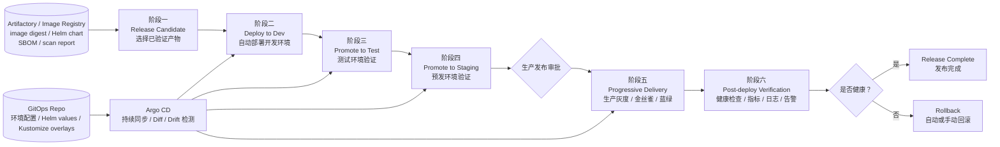
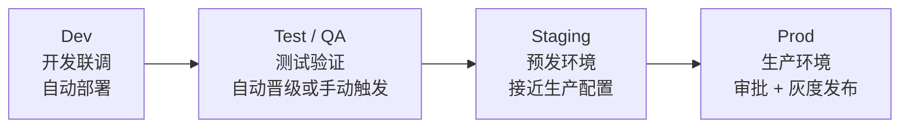
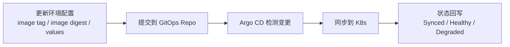
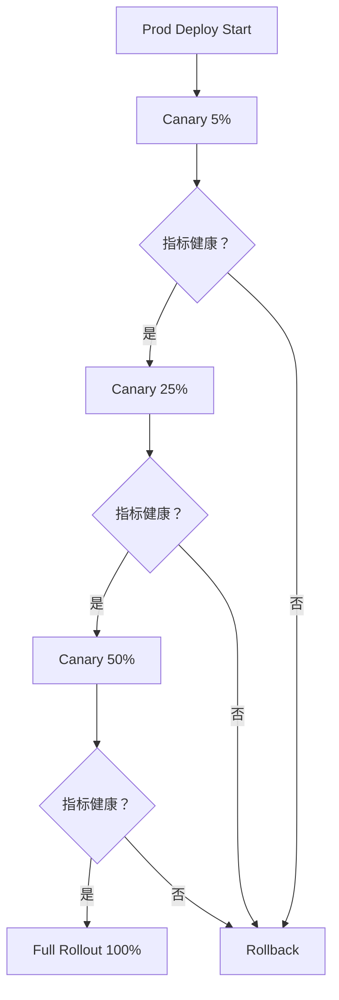
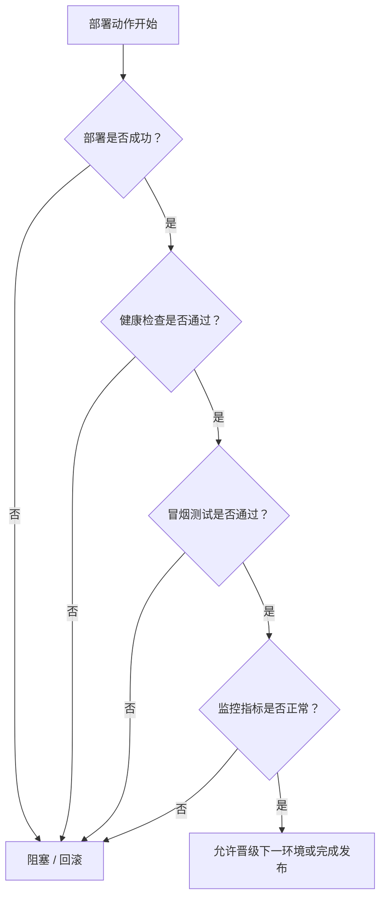
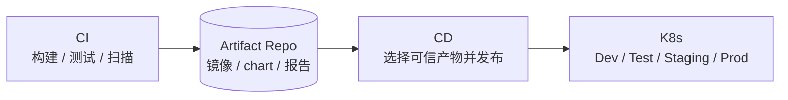

# K8s CD 流程设计

## 1. 总览图



## 2. 阶段说明

| 阶段 | 用什么 | 做什么 | 目的 |
| --- | --- | --- | --- |
| 阶段一：Release Candidate | Artifactory、Image Registry、SBOM、扫描报告 | 选择 CI 已验证的镜像 digest 和 chart | 只发布可信产物 |
| 阶段二：Deploy to Dev | Argo CD、Helm/Kustomize、K8s Dev Namespace | 自动部署开发环境 | 快速验证部署配置 |
| 阶段三：Promote to Test | Argo CD、自动化测试、API Test、E2E Test | 晋级到测试环境并跑验证 | 验证功能和接口行为 |
| 阶段四：Promote to Staging | Argo CD、Staging Cluster、生产相似配置 | 部署预发环境，跑冒烟和回归 | 尽量贴近生产验证 |
| 阶段五：Progressive Delivery | Argo Rollouts、Istio/Nginx Ingress、Prometheus | 生产灰度、金丝雀、蓝绿发布 | 降低生产发布风险 |
| 阶段六：Post-deploy Verification | Prometheus、Grafana、Loki/ELK、Alertmanager | 看健康检查、错误率、延迟、日志、告警 | 判断发布是否成功 |
| Rollback | Argo CD、Helm rollback、kubectl rollout undo | 回滚到上一个稳定版本 | 快速止损 |

## 3. 推荐环境



推荐环境设计：

- Dev：自动部署，允许频繁变更。
- Test / QA：跑 API、E2E、回归测试。
- Staging：尽量贴近生产，用于发布前验证。
- Prod：必须审批，使用灰度、金丝雀或蓝绿发布。

## 4. GitOps 方式

推荐用 GitOps 管 CD，不建议直接在流水线里到处执行 `kubectl apply`。



GitOps Repo 里放：

- Helm chart。
- Helm values。
- Kustomize overlays。
- 每个环境的 image digest。
- ConfigMap / Secret 引用。
- HPA、Ingress、Service、Deployment 等 K8s 配置。

好处：

- 发布动作可审计。
- 环境状态可追踪。
- 配置变更可 Review。
- 集群漂移可以被 Argo CD 发现。
- 回滚可以通过 Git revert 或 Argo rollback 完成。

## 5. 生产发布策略



推荐灰度指标：

- Pod 是否 Ready。
- HTTP 5xx 是否升高。
- P95 / P99 延迟是否升高。
- CPU / Memory 是否异常。
- 核心业务指标是否异常。
- Error log 是否明显增加。

## 6. CD Quality Gate

CD 也应该有门禁，不是把镜像推上去就结束。



CD 门禁关注：

- K8s rollout 是否成功。
- Pod 是否 Ready。
- Service 是否可访问。
- 冒烟测试是否通过。
- 错误率和延迟是否正常。
- 告警是否触发。
- 灰度阶段是否满足晋级条件。

## 7. 和 CI 的关系



CI 负责证明这个产物“能不能被交付”。

CD 负责证明这个产物“能不能稳定运行在目标环境里”。

## 8. 最终推荐

```text
CI 产出可信制品，
CD 只发布可信制品，
GitOps 管环境状态，
Argo CD 执行同步，
生产使用灰度发布，
指标异常立即回滚。
```

