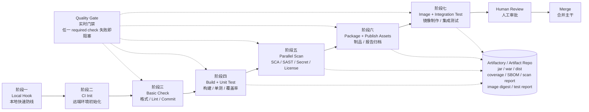
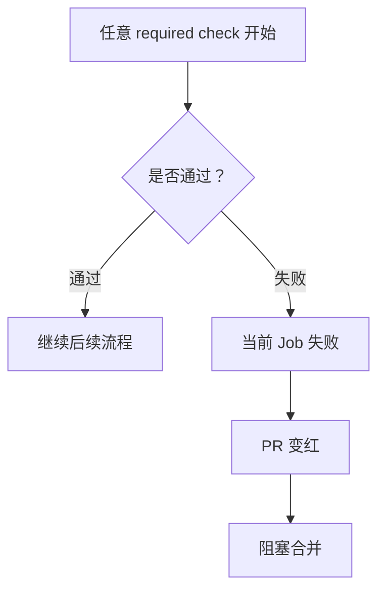
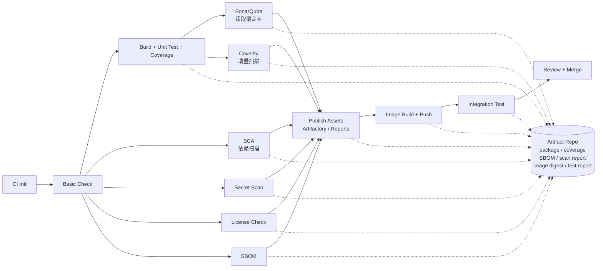

# Code Quality Gate 流程设计

## 1. 总览图



## 2. 阶段说明

| 阶段 | 用什么 | 做什么 | 目的 |
| --- | --- | --- | --- |
| 阶段一：Local Hook | Husky、lint-staged、pre-commit、Prettier、ESLint、Spotless、commitlint | 本地格式化、基础 lint、commit message 校验 | 提交前快速修小问题 |
| 阶段二：CI Init | git checkout、Node.js、JDK、npm cache、Maven cache | 拉代码、装环境、恢复缓存、安装依赖 | 给后续检查准备环境 |
| 阶段三：Basic Check | commitlint、Prettier check、ESLint、Checkstyle | 远端校验提交规范、格式和代码规范 | 防止本地 hook 被绕过 |
| 阶段四：Build + Unit Test | npm build、npm test、Maven/Gradle test、JaCoCo | 构建、单测、生成覆盖率 | 验证基础逻辑和可构建性 |
| 阶段五：Parallel Scan | SCA、SonarQube、Coverity 增量扫描、gitleaks、License Check、SBOM | 依赖安全、代码质量、安全漏洞、密钥、License 检查 | 并行发现质量和安全风险 |
| 阶段六：Package + Publish Assets | Artifactory、Nexus、CI Artifacts | 归档 jar/war/dist、coverage、SBOM、扫描报告、测试报告 | 留下可追踪、可审计、可回滚的 CI 资产 |
| 阶段七：Image + Integration Test | Docker build、Image Registry、Trivy image scan、临时环境、API/E2E/Contract Test | 制作镜像、推送镜像、扫描镜像、部署临时环境、跑集成测试 | 验证服务在真实运行形态下是否可用 |
| Human Review | Reviewer、CODEOWNERS | 看业务逻辑、设计、架构和可维护性 | 机器检查之后的人为判断 |

## 3. Quality Gate 怎么理解

Quality Gate 不是最后单独跑的一步，而是贯穿远端 CI 的实时门禁。



也就是说：

- `commitlint` 失败，直接阻塞。
- `lint` 失败，直接阻塞。
- `build` 失败，直接阻塞。
- `unit test` 失败，直接阻塞。
- `SCA / SonarQube / Coverity` 发现高危问题，直接阻塞。
- 制品发布、`image build` 或集成测试失败，直接阻塞。

没有依赖关系的检查可以并行跑；有问题就尽早失败。

## 4. 并行关系



重点：

- SCA、Secret、License、SBOM 可以较早并行跑。
- SonarQube 通常需要覆盖率报告，所以依赖单测结果。
- Coverity 在 PR 中建议跑增量扫描，全量扫描放 nightly 或 release 前。
- Artifactory / Artifact Repo 负责留下包、报告、SBOM、扫描结果和镜像信息。
- 镜像制作和集成测试应放在基础构建、单测、安全质量扫描、制品归档之后。

## 5. 最终推荐

```text
本地快速修小问题，
远端并行查质量和安全风险，
制品和报告进入资产库，
镜像阶段验证真实交付形态，
任何 required check 失败都立即阻塞合并。
```
