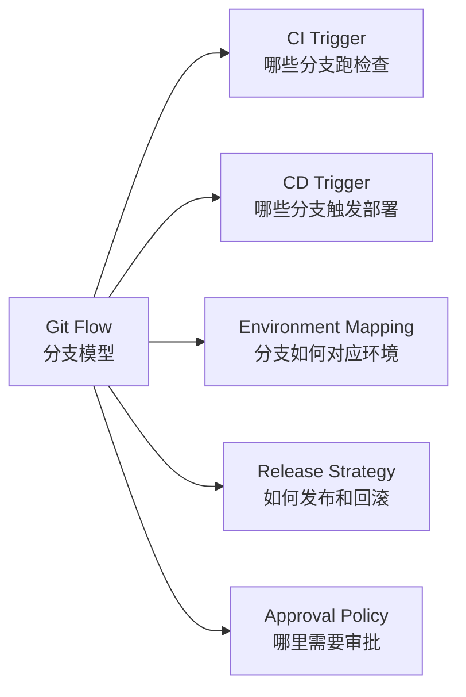
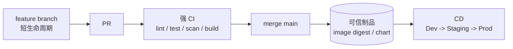
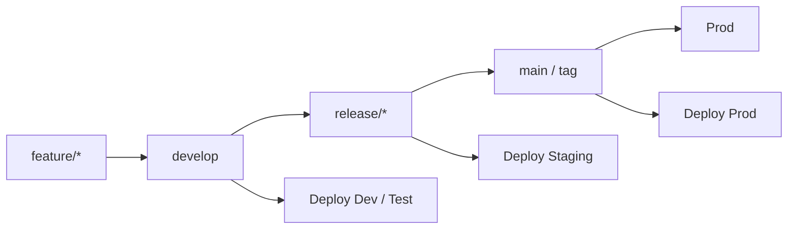
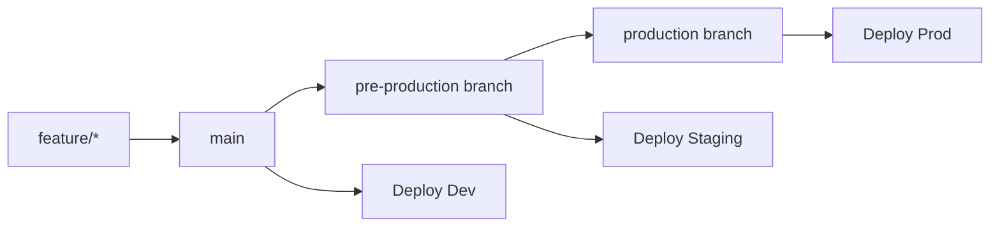

# Git Flow 与 CI/CD 映射设计

## 1. 核心观点

不同 Git Flow 会影响 CI/CD 的触发点、门禁强度、环境映射和发布节奏。



所以 CI/CD 不是单独设计的，应该先明确团队采用哪种版本管理模型。

## 2. 常见 Git Flow 对比

| 模型 | 分支特点 | CI/CD 特点 | 适合场景 |
| --- | --- | --- | --- |
| Trunk-based | 主干短周期集成，feature branch 很短 | PR 强 CI，main 始终可发布，CD 按制品晋级 | 高频发布、SaaS、互联网服务 |
| GitHub Flow | feature branch -> PR -> main | 简单直接，main 合并后触发部署 | 中小团队、Web 服务 |
| Git Flow | feature -> develop -> release -> main | 分支和环境绑定更强，release 分支承载回归和发版 | 版本发布制、传统企业、客户端 |
| GitLab Flow | main + 环境分支或发布分支 | 通过环境分支推进部署 | 多环境晋级，但不想使用完整 Git Flow |
| Aone/平台流 | 需求、迭代、发布单驱动 | 平台编排分支、流水线、环境和审批 | 大组织、多团队、多系统协作 |

## 3. Trunk-based Development



特点：

- main 始终保持可发布。
- feature branch 生命周期很短。
- CI 门禁必须强。
- CD 更关注“制品晋级”，而不是“分支晋级”。

适合：

- 高频发布。
- 微服务。
- SaaS。
- 自动化程度高的团队。

## 4. GitHub Flow


特点：

- 流程简单。
- 所有变更通过 PR 进入 main。
- main 通常代表可部署状态。
- 部署可以自动，也可以加审批。

适合：

- Web 应用。
- API 服务。
- 中小团队。
- 不需要复杂 release 分支的项目。

## 5. Git Flow



推荐映射：

| 分支 | CI/CD 行为 |
| --- | --- |
| feature/* | 跑基础 CI，不直接部署生产 |
| develop | 跑完整 CI，自动部署 Dev / Test |
| release/* | 跑完整 CI + 回归 + 安全扫描，部署 Staging |
| main / tag | 只发布已验证 release 产物到 Prod |
| hotfix/* | 快速修复，跑必要门禁后进入 main 和 develop |

特点：

- 分支和环境关系清晰。
- release 分支适合做版本冻结、回归测试和发布准备。
- 流程比 Trunk-based 更重。

适合：

- 固定版本发布。
- 多团队协作。
- 客户端、嵌入式、金融、传统企业系统。

## 6. GitLab Flow



特点：

- 比 Git Flow 简单。
- 保留环境晋级概念。
- 可以用环境分支表达部署状态。

适合：

- 需要 Dev / Staging / Prod 晋级。
- 不想维护 develop、release、hotfix 复杂分支。
- GitLab 体系或类似平台。

## 7. Aone / 平台化研发流

这里的 Aone 指类似大厂内部研发平台的流程，不一定是某一个固定 Git 模型。


特点：

- 以需求、迭代、发布单为中心。
- 平台统一编排代码、构建、测试、部署、审批。
- 分支只是流程的一部分，不是唯一核心。
- 适合强治理、多团队、多系统协作。

适合：

- 大型组织。
- 多系统联动发布。
- 需要变更单、审批流、审计记录的企业。

## 8. Hotfix 流程

Hotfix 不应该完全绕过门禁，只应该缩短路径。


Hotfix 必须保留：

- commitlint。
- build。
- unit test。
- 关键安全扫描。
- 镜像制作。
- 冒烟测试。
- 审批。
- 回合主干或开发分支。

可以缩短：

- 非核心全量回归。
- 低风险异步扫描。
- 非阻塞质量报告。

## 9. 选择建议

| 团队情况 | 推荐模型 |
| --- | --- |
| 高频发布、自动化成熟 | Trunk-based |
| 中小团队、Web 服务 | GitHub Flow |
| 固定版本、强测试周期 | Git Flow |
| 需要环境分支晋级 | GitLab Flow |
| 大组织、平台化研发治理 | Aone / 平台化研发流 |

## 10. 最终建议

```text
先定 Git Flow，
再定 CI 触发点，
再定 CD 环境映射，
最后定发布审批和回滚策略。
```

CI/CD 的设计不应该脱离分支模型。

分支模型越轻，CI 门禁越要强；  
分支模型越重，环境晋级和发布治理越要清晰。

